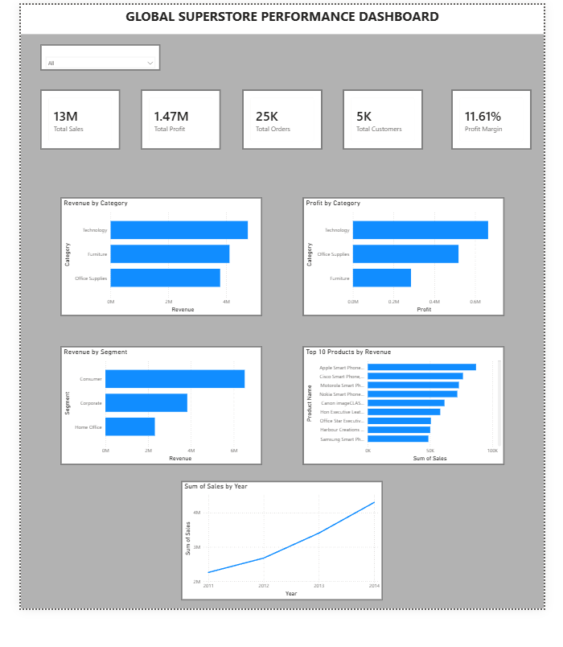

# Global Superstore Sales Analytics Dashboard | Python & Power BI

## Project Overview

This project analyzes the Global Superstore dataset using Python, Pandas, Jupyter Notebook, and Power BI. The objective is to uncover business insights related to sales performance, profitability, customer behavior, product performance, and regional trends.

The project follows a complete data analytics workflow, starting from data exploration and cleaning in Python to building an interactive business intelligence dashboard in Power BI.

---

## Project Highlights

- Analyzed 50,000+ retail transactions from the Global Superstore dataset.
- Performed data cleaning and exploratory data analysis using Python and Pandas.
- Built interactive Power BI dashboards with KPI tracking and business insights.
- Created DAX measures for advanced business metrics.
- Identified sales, profit, customer, product, and regional performance trends.

---

## Objectives

* Analyze sales and profit performance.
* Identify top-performing product categories and sub-categories.
* Understand customer and market segment behavior.
* Explore regional and geographic sales trends.
* Create an interactive dashboard for business decision-making.

---

## Tools & Technologies

* Python
* Pandas
* NumPy
* Matplotlib
* Jupyter Notebook
* Power BI
* DAX

---

## Project Workflow

### 1. Data Collection

* Imported the Global Superstore dataset.

### 2. Data Understanding

* Previewed the dataset using `df.head()`
* Examined structure using `df.info()`
* Generated descriptive statistics using `df.describe()`
* Checked missing values using `df.isnull().sum()`

### 3. Data Analysis

* Sales Analysis
* Profit Analysis
* Category Analysis
* Sub-Category Analysis
* Customer Analysis
* Segment Analysis
* Geographic Analysis
* Product Performance Analysis

### 4. Data Visualization

Created visualizations to identify:

* Sales distribution
* Profit trends
* Category performance
* Customer behavior
* Regional performance

### 5. Business Intelligence Dashboard

Developed an interactive Power BI dashboard featuring:

* Total Sales KPI
* Total Profit KPI
* Total Orders KPI
* Total Customers KPI
* Profit Margin KPI
* Revenue Trend Analysis
* Category-wise Performance
* Segment-wise Performance
* Top Products Analysis

---

## Dashboard KPIs

|     Metric     |   Value  |        
|----------------|----------|
| Total Sales    | $12.64M  |
| Total Profit   | $1.47M   |
| Total Orders   | 25K+     |
| Total Customers| 4.8K+    |
| Profit Margin  | 11.6%    |

## Key Insights

- Technology generated the highest revenue and profit among all categories.
- Consumer Segment contributed the largest share of total sales.
- Revenue increased consistently from 2011 to 2014, indicating strong business growth.
- Furniture generated significant revenue but lower profitability compared to Technology.
- The United States was the largest contributor to overall sales.
- Overall profit margin remained approximately 11.6%.

---

## Repository Structure

```text
global-superstore-powerbi-performance-dashboard
│
├── data/
│   └── Global_Superstore.csv
│
├── notebook/
│   └── ecommerce_analysis.ipynb
│
├── powerbi/
│   └── Global_Superstore_Dashboard.pbix
│
├── reports/
│   └── dashboard_preview.png
│
├── requirements.txt
│
└── README.md
```

## Dashboard Preview





---

## Skills Demonstrated

* Data Cleaning
* Exploratory Data Analysis (EDA)
* Data Visualization
* Business Analytics
* Dashboard Development
* KPI Design
* DAX Measures
* Data Storytelling

---

## Future Improvements

* Advanced DAX Measures
* Drill-through Pages
* Forecasting Analysis
* Customer Segmentation
* SQL-Based Data Extraction

---

## Project Outcome

Successfully developed an end-to-end business intelligence solution by combining Python-based exploratory data analysis with Power BI dashboarding. The project demonstrates the ability to clean, analyze, visualize, and communicate business insights using industry-standard analytics tools.

---
## Author

Rudra Patel

Data Analysis | Python | SQL | Power BI | Data Visualization

GitHub: [www.github.com/rudra20-04]
